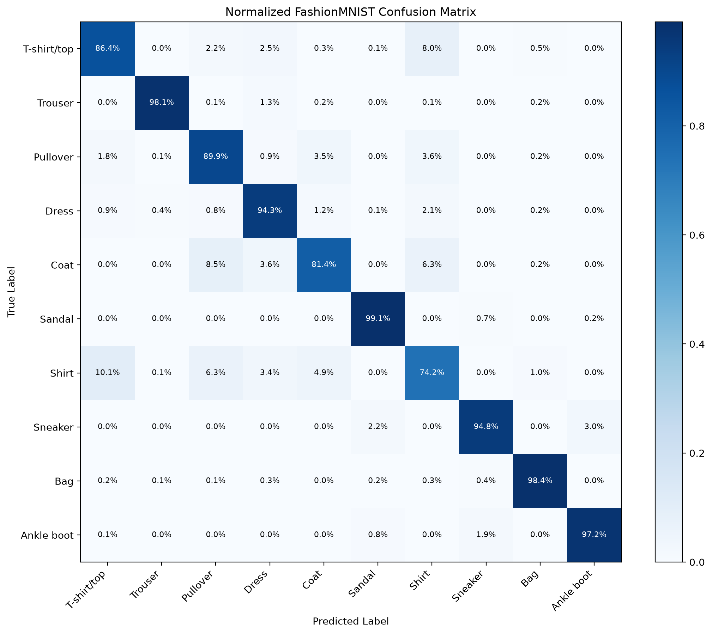

# PyTorch 与深度学习基础

这一阶段按“张量基础 → 神经网络 → 训练流程 → CNN 项目 → 模型分析”的顺序推进。

## 目录说明

```text
01-pytorch-basics/
├── lessons/         # 按编号排列的主线课程
├── projects/        # 可以独立运行的完整项目
├── practice/        # 早期练习和小型代码实验
├── python-review/   # Python 语法复习与环境检查
├── outputs/         # 值得保留并展示的实验图片
├── LEARNING-PROGRESS.md
└── README.md
```

## 主线课程

| 序号 | 主题 | 核心内容 | 文件 |
| ---: | --- | --- | --- |
| 01 | Tensor 基础 | 张量创建、形状、索引和常见运算 | [01-tensor-basics.py](lessons/01-tensor-basics.py) |
| 02 | Broadcasting | 广播规则与维度对齐 | [02-broadcasting.py](lessons/02-broadcasting.py) |
| 03 | NumPy 与 Tensor | 数据转换、复制和共享内存 | [03-numpy-and-tensor.py](lessons/03-numpy-and-tensor.py) |
| 04 | Autograd | 计算图、反向传播和梯度 | [04-autograd.py](lessons/04-autograd.py) |
| 05 | `nn.Module` | 自定义模型、参数与状态字典 | [05-module-basics.py](lessons/05-module-basics.py) |
| 06 | 激活函数与 MLP | 非线性激活和多层网络 | [06-activation-and-mlp.py](lessons/06-activation-and-mlp.py) |
| 07 | 常见学习任务 | 回归、二分类和多分类 | [07-learning-tasks.py](lessons/07-learning-tasks.py) |
| 08 | Dataset 与 DataLoader | 数据集封装、批处理和打乱 | [08-dataset-and-dataloader.py](lessons/08-dataset-and-dataloader.py) |
| 09 | 数据集划分 | 训练集、验证集与测试集 | [09-train-validation-test.py](lessons/09-train-validation-test.py) |
| 10 | 欠拟合与过拟合 | Dropout、权重衰减和早停 | [10-underfitting-and-overfitting.py](lessons/10-underfitting-and-overfitting.py) |
| 11 | Checkpoint | 保存、恢复训练与加载最佳模型 | [11-checkpoint-and-resume.py](lessons/11-checkpoint-and-resume.py) |
| 12 | CNN 基础 | 卷积、池化、展平和图像分类网络 | [12-conv2d-and-pooling.py](lessons/12-conv2d-and-pooling.py) |
| 13 | 模型评估 | 混淆矩阵、分类指标和错误样本分析 | [13-confusion-matrix-analysis.py](lessons/13-confusion-matrix-analysis.py) |

## 完整项目

### FashionMNIST CNN

[01-fashion-mnist-cnn.py](projects/01-fashion-mnist-cnn.py) 包含一条完整训练链路：

1. 下载并划分 FashionMNIST 数据集
2. 构建 CNN
3. 训练并保存验证集最佳模型
4. 在测试集上评估
5. 输出样本预测与置信度

课程 13 会在这个模型的基础上继续生成混淆矩阵和高置信度错误样本。

## 练习区

`practice/` 保存学习早期的小实验。它们按知识点重新命名，适合快速复习某个概念，不作为主线课程重复阅读。

- 数据准备：CSV 自定义数据集
- 梯度与模型：手动梯度、`nn.Module`
- 训练组件：损失函数、优化器、DataLoader
- 任务示例：线性回归、二分类、多分类和 MLP

## 如何运行

建议始终从仓库根目录运行，这样数据、权重与输出路径保持一致：

```bash
python 01-pytorch-basics/lessons/01-tensor-basics.py
python 01-pytorch-basics/projects/01-fashion-mnist-cnn.py
python 01-pytorch-basics/lessons/13-confusion-matrix-analysis.py
```

## 数据与实验产物

- `data/`：下载的数据集，仅保留在本地
- `*.pth`：模型权重与训练断点，仅保留在本地
- `outputs/`：适合在 GitHub 展示的分析图片

当前保留的分析结果：

- [原始混淆矩阵](outputs/confusion_matrix.png)
- [归一化混淆矩阵](outputs/normalized_confusion_matrix.png)
- [高置信度错误样本](outputs/wrong_predictions.png)

当前 FashionMNIST 测试结果：

| 指标 | 结果 |
| --- | ---: |
| 测试集准确率 | 91.38% |
| 识别最好类别 | Sandal（99.10% Recall） |
| 识别最弱类别 | Shirt（74.20% Recall） |



## 下一步

- 补充 ResNet 的残差连接实现
- 学习 RNN/LSTM 的序列建模基础
- 把训练与评估逻辑提取成可复用模块
- 为关键组件增加自动化测试

完成本阶段的核心内容后，进入 [阶段 2：Transformer 原理与手写实现](../02-transformer/README.md)。
